# Nestquest

**NestQuest** is a full-stack MERN (MongoDB, Express.js, React, Node.js) application that allows users to explore, list, and book rental properties. It includes full authentication, booking management, property categorization, map-based location display, and a feature-rich Admin Panel for platform management. Users can add listings, manage bookings, and browse properties with a fast, intuitive UI — while admins can monitor activity, analyze trends, and manage users/listings efficiently.

---

## User Features
- User Authentication & Authorization
Register, log in, and access secure routes with JWT + httpOnly cookies.
- Add, Update & Delete Listings
Authorized users can create and manage their property listings.
- Search Properties
Search using city name, title, or keywords.
- Sort by Property Category
Categories like PG, Villa, Flat, Rooms, Farm House, Pool House, etc.
- Map Integration
Each property shows its exact location using latitude & longitude.
- View Property Details
Users can view full listing details including images and description.
- Book Property
Users can book any unbooked property and view their own bookings.
- View Own Listings
Owners can see and manage all the listings they have created.
- View Own Bookings
Users can see all previous and active bookings.
- Fast & Responsive UI (Tailwind + Vite)
Built using Vite + TailwindCSS for optimal performance.

## Admin Panel Features

The Admin Dashboard provides complete control and analytics for platform management:

### Dashboard Analytics

- Summary Cards
Quick stats for total users, total listings, total bookings, etc.

- Single Map View
Displays all property coordinates from all cities on one map.

- Charts & Insights

    1. Monthly Booking Trends – Area chart

-- User Growth Over Time – Area chart

-- Listings by City – Pie chart

-- Top Host & Top Guest – Combined area chart

- Admin Listings Management

-- Admin can view every listing in the system in a list/table view.

-- Details component to see any listing with full details.

-- Admin has full control to allow or remove listings from the platform.

- Admin User Management

-- View all registered users in the system and their details.

-- Admin can delete users from the platform.

##  Tech Stack

### Frontend
- React (Vite)
- TailwindCSS
- Redux Toolkit
- React Router DOM
- react-chartjs-2
- Leaflet / (Map Integration)
  

### Backend
- Node.js
- Express.js
- MongoDB
- Mongoose
- JWT Authentication 

## 📦 Packages / Dependencies

### Frontend
- react
- react-dom
- react-icons
- react-spinners
- react-toastify
- @reduxjs/toolkit
- react-redux
- react-router-dom
- axios
- tailwindcss
- react-chartjs-2
- leaflet

### Backend
- express
- mongoose
- jsonwebtoken
- bcryptjs
- multer
- cookie-parser
- cors
- dotenv
- cloudinary

---
#  Screenshots
## User Side

### User registration

### User Login
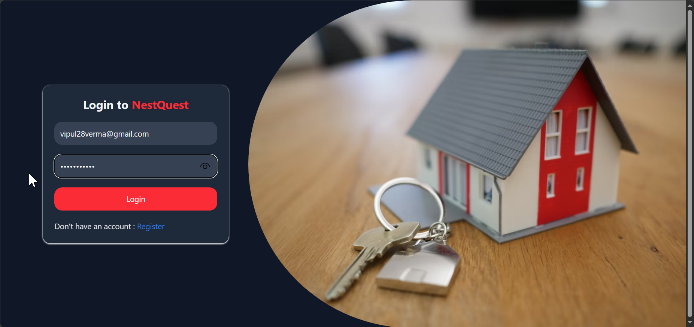
### Home page
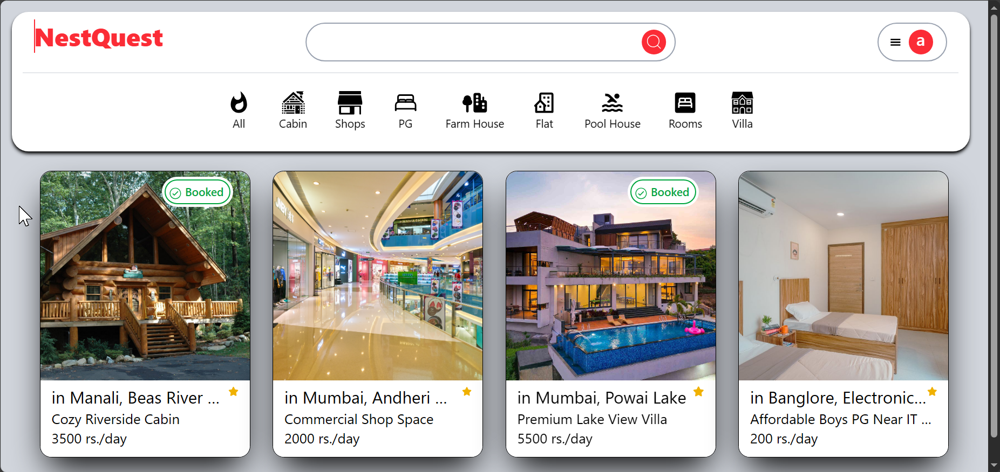
### Search Bar 
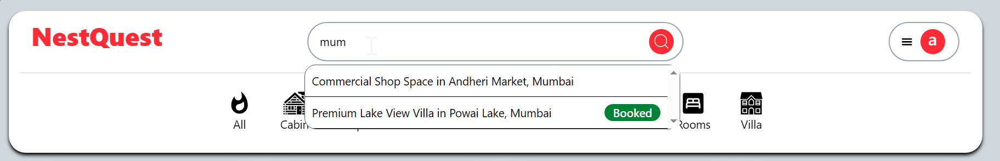
### Add Listing Page-1 
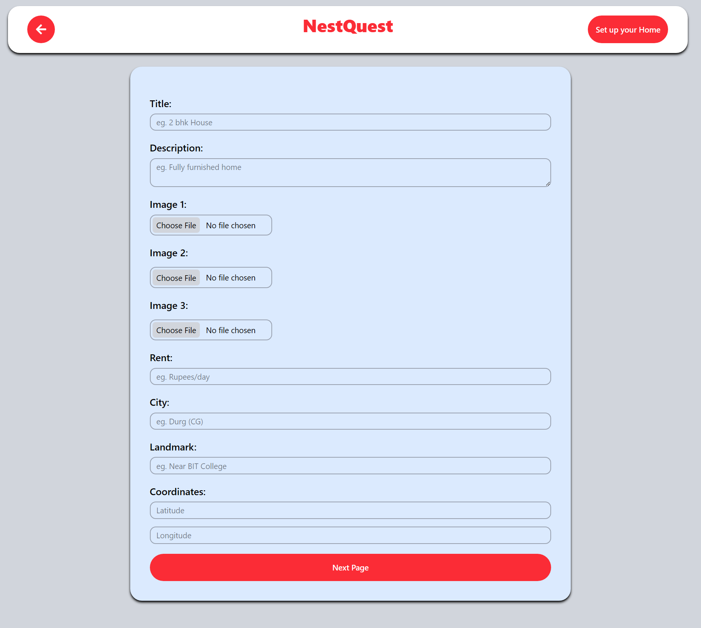
### Add Listing Page-2
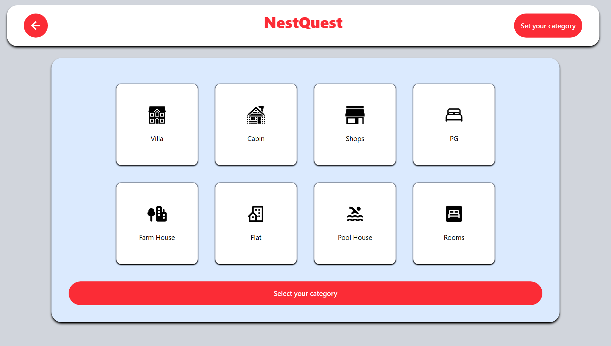
### Add Listing Page-3
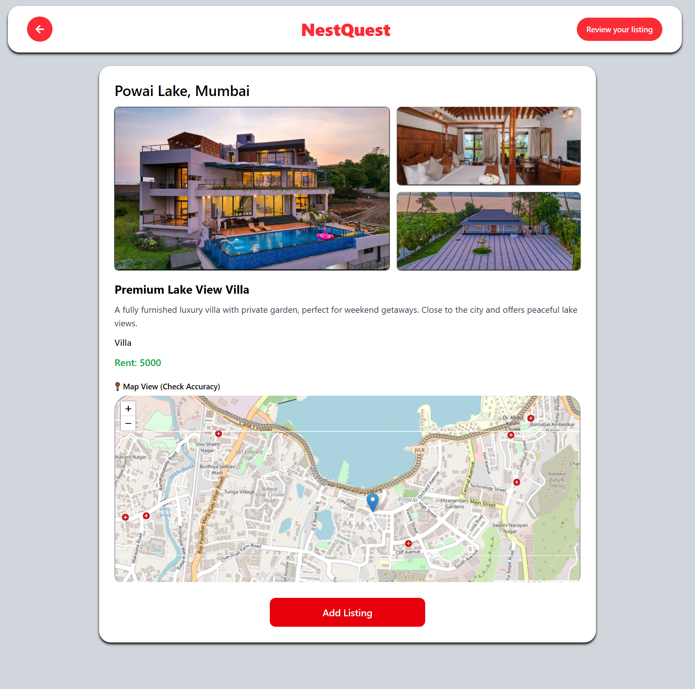
### Booked Property by User
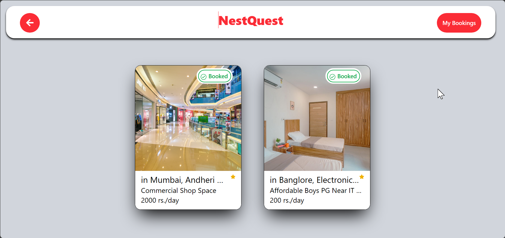
### Listed property by User

### Confirm Booking by adding date
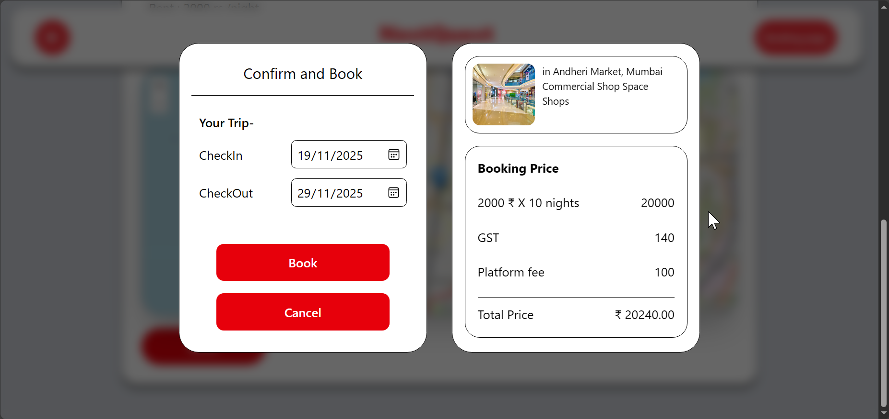
### Cancel Booking
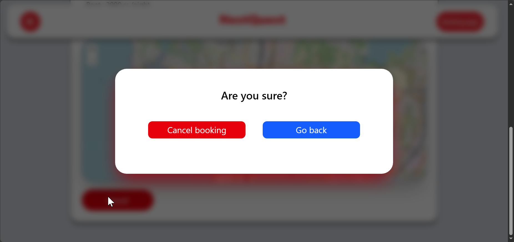
### Update

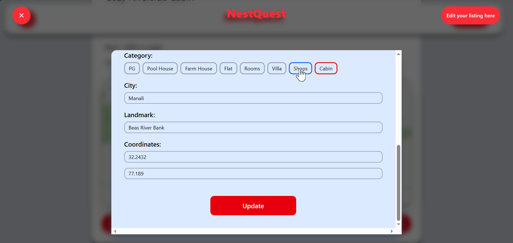

### Update page

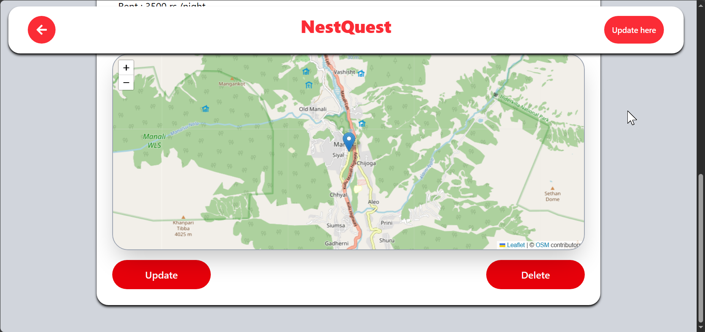

## Admin Panel
### Summary Page
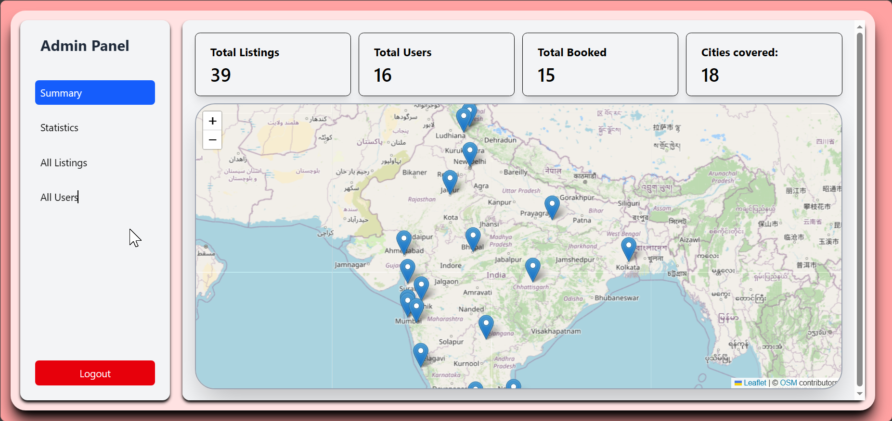
### Statistics

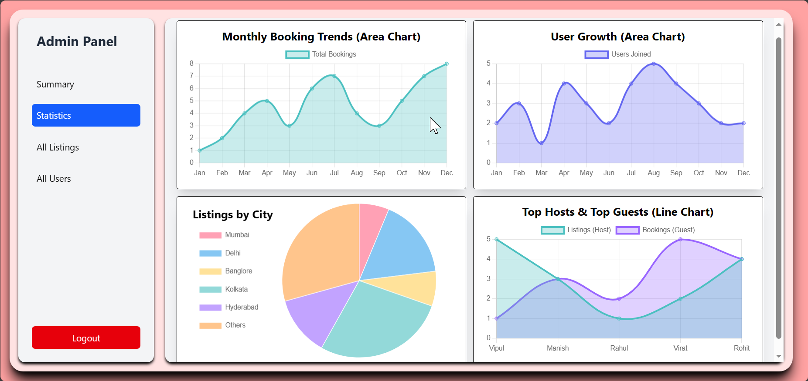
### All Property Listings

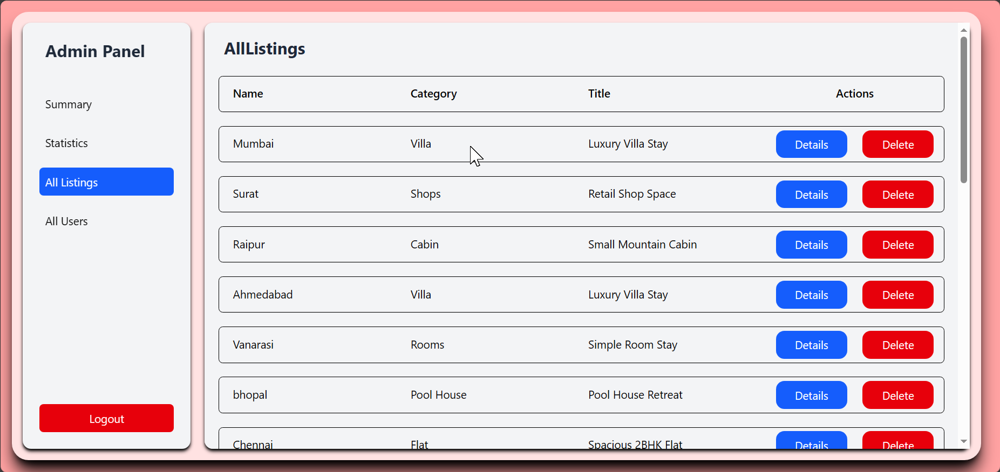

### All Users

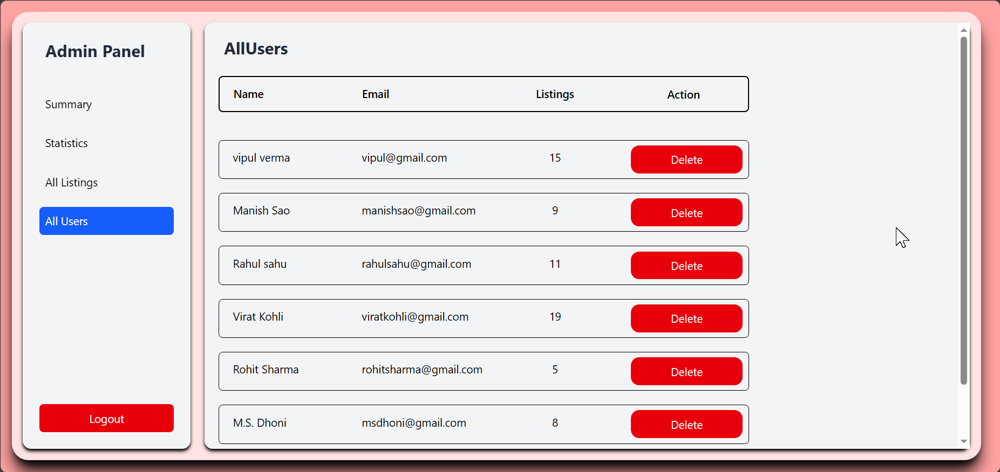

